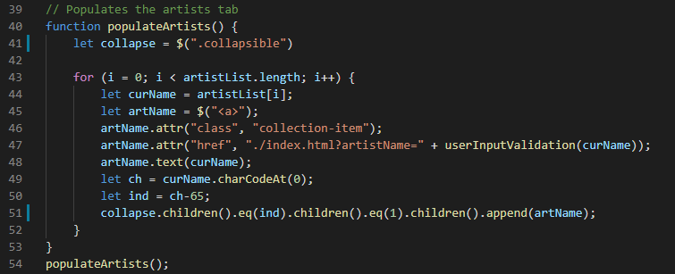

# 3D Gallery Walk

---

## Table of Contents

- [3D Gallery Walk](#3d-gallery-walk)
  - [Table of Contents](#table-of-contents)
  - [Description](#description)
  - [Prerequisites](#prerequisites)
  - [Built With](#built-with)
  - [Technologies Used](#technologies-used)
  - [Practices Used](#practices-used)
  - [Deployed Link](#deployed-link)
  - [Important Code Snippets](#important-code-snippets)
  - [Wireframes](#wireframes)
  - [Authors](#authors)
  - [Acknowledgments 😊](#acknowledgments-)
  - [License](#license)
  - [Questions](#questions)
  

## Description

Welcome to this 3D virtual museum experience! With the use of 3D rendering technology, we invite the viewer to get in a close and examine art with even greater detail. 

[Click this link to go to the live site](https://argibson02.github.io/3d-gallery-walk/)
  

**See this unique experience in action!**

## Features
**Viewing 3D Paintings**
Zoom in and manipulate paintings! See how light reflects off the oil! Feel each individual brush stroke! Experience time in the depths of each individual crack!
[Demo of image viewing]()

**Save Favorites**
Found a piece you like? Save it so you can view it again later!
[Demo of saving images]()

**Share Favorites**
Share your favorite images by creating QR code and sending it to you friends.
[Demo of QR code]()

**Responsive Design**
Use our site on any size screen.
[Demo of responsive design]()

**View curated artists and paintings**
Not sure where to start? To try checking out the Artists and Featured tabs until Browse.
[Demo of curated artists and paintings]()

## Prerequisites
Any modern internet browser will do!

## Built With

* [HTML](https://developer.mozilla.org/en-US/docs/Web/HTML)
* [CSS](https://developer.mozilla.org/en-US/docs/Web/CSS)
* [JavaScript](https://developer.mozilla.org/en-US/docs/Web/JavaScript)
* [jQuery](https://api.jquery.com/)
* [Materialize CSS](https://materializecss.com/)
* [Rijksmuseum API](https://data.rijksmuseum.nl/object-metadata/api/)
* [three.js](https://threejs.org/)
* [jimp](https://www.npmjs.com/package/jimp)
* [QR Code Generator API](https://goqr.me/api/)

## Technologies Used

* [Microsoft Visual Studio Code](https://code.visualstudio.com/)
* [Git Bash](https://git-scm.com/downloads)
* [GitHub](https://github.com/)
* [NVDA Screen Reader](https://www.nvaccess.org/)
* [WAVE Web Accessibility Evaluation Tool](https://wave.webaim.org/)
* [Lighthouse](https://developers.google.com/web/tools/lighthouse/)
* [Google Chrome Developer Tools](https://developer.chrome.com/docs/devtools/)

## Practices Used

* Agile style User Story and Acceptance Criteria.
* [Web Content Accessibility Guidelines](https://www.w3.org/WAI/standards-guidelines/wcag/)

## Deployed Link

* [See the Live Site!](https://argibson02.github.io/3d-gallery-walk/)

## Authors

**Alexander Gibson** 

- [Link to Alex's Github](https://github.com/argibson02)
- [Link to Alex's LinkedIn](www.linkedin.com/in/alexander-gibson-1b0bb6105)

**Henry Kam**

- [Link to Henry's Github](https://github.com/gulpinhenry)
- [Link to Henry's LinkedIn](https://www.linkedin.com/in/kamhenry/)

**Adam Kruschwitz**

- [Link to Adam's Github](https://github.com/AdamKruschwitz)
- [Link to Adam's LinkedIn](https://www.linkedin.com/in/adamkruschwitz/)

## Important Code Snippets
* Collecting parameters through the URL:

* Populating the artist tab with links directing to the mane page with search parameters:

* Generating a normal map based on a given jpg image

## Wireframes

## Acknowledgments 😊

- Thanks to Jerome, Manuel, Cheng, and Daniel for instructing the UCB Coding Bootcamp.
- Thanks to Eric Meyer for the [CSS reset file](https://meyerweb.com/eric/tools/css/reset/).

## License

This application is covered under the MIT license

## Questions

For any questions, please reach out by creating an issue.
